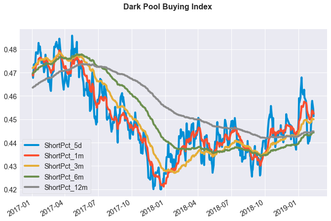

# Dark Pool Buying
Calculates estimate of dark pool buying index ("DIX") based on publicly available data from the NYSE, NASDAQ, and OTC Reporting Facility ("ORF") exchanges. Concept courtesy of Squeeze Metrics whitepaper here: https://squeezemetrics.com/monitor/download/pdf/short_is_long.pdf?

Dependencies: pandas, numpy, tqdm

